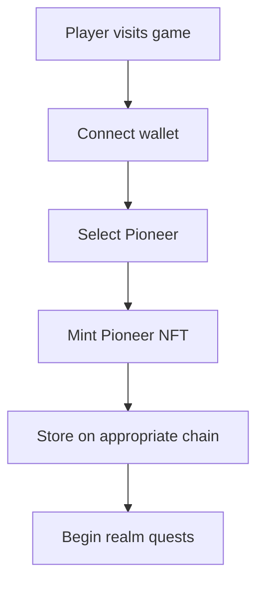
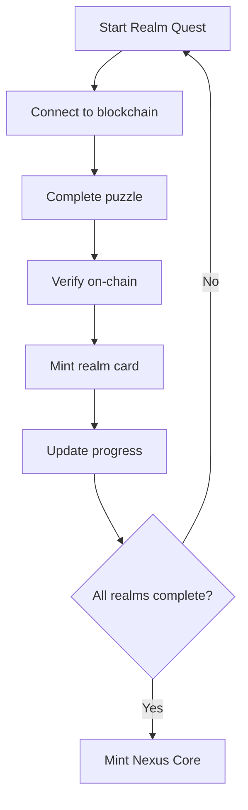
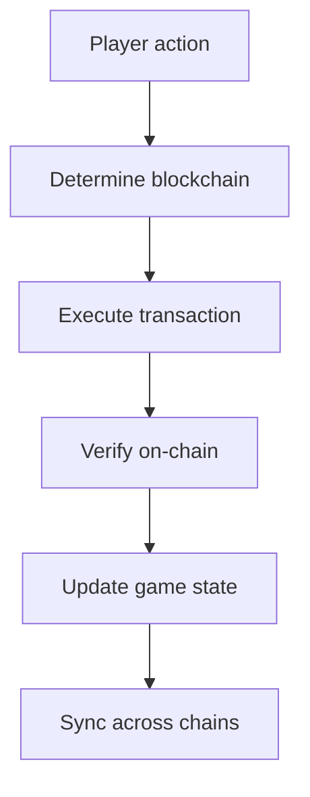

# Blockchain Integration Overview

## Architecture Overview

The Interchain Nexus integrates with multiple blockchain ecosystems, each representing a different realm in the game. Players interact with these blockchains through their chosen Pioneer NFT and complete realm-specific puzzles.

## Blockchain Ecosystem Map

```
┌─────────────────┬─────────────────┬─────────────────┬─────────────────┐
│      Base       │      ENS        │    Filecoin     │      Flare      │
│                 │                 │                 │                 │
│ Social Architect│Identity Guardian│  Data Weaver    │  Oracle Seer    │
│                 │                 │                 │                 │
│ Forge Halls     │ Hall of Names   │Vaults of Memory │ Oracle Spire    │
│                 │                 │                 │                 │
│ Builder Puzzles │Identity Puzzles │Archive Puzzles  │Oracle Puzzles   │
│                 │                 │                 │                 │
│ Forge Ember     │  True Name      │ Memory Shard    │ Oracle Seal     │
└─────────────────┴─────────────────┴─────────────────┴─────────────────┘
                                │
                                ▼
                        ┌─────────────────┐
                        │   Governance    │
                        │                 │
                        │ Consensus Weaver│
                        │                 │
                        │ Council Chambers│
                        │                 │
                        │Governance Puzzles│
                        │                 │
                        │ Council Mark    │
                        └─────────────────┘
                                │
                                ▼
┌─────────────────┬─────────────────┬─────────────────┬─────────────────┐
│     Ethereum    │    Polkadot     │     Privacy     │      Zama       │
│                 │                 │                 │                 │
│Aetherial Alchemist│Chrono Synthesizer│Shadow Weaver  │Confidential Guardian│
│                 │                 │                 │                 │
│ Alchemy Labs    │ Time Chambers   │Shadow Realm    │Confidential Vault│
│                 │                 │                 │                 │
│Transmutation Puzzles│Synthesis Puzzles│Stealth Puzzles│Encryption Puzzles│
│                 │                 │                 │                 │
│ Alchemy Stone   │ Time Crystal    │ Shadow Cloak   │ Confidential Key│
└─────────────────┴─────────────────┴─────────────────┴─────────────────┘
                                │
                                ▼
┌─────────────────┬─────────────────┬─────────────────┐
│     Citrea      │   Symbiotic     │   Advanced      │
│                 │                 │                 │
│ Bitcoin Oracle  │Security Architect│   Protocols     │
│                 │                 │                 │
│ Bitcoin Forge   │Security Markets │Future Realms    │
│                 │                 │                 │
│Bitcoin Puzzles  │Security Puzzles │Coming Soon...   │
│                 │                 │                 │
│ Bitcoin Seal    │ Security Token  │   TBD           │
└─────────────────┴─────────────────┴─────────────────┘
                        │   Governance    │
                        │                 │
                        │Consensus Weaver │
                        │                 │
                        │Council Chambers │
                        │                 │
                        │Voting Puzzles   │
                        │                 │
                        │ Council Mark    │
                        └─────────────────┘
```

## Smart Contract Architecture

### Core Contracts

1. **Pioneer.sol** - Pioneer NFT minting and management
2. **RealmQuest.sol** - Realm puzzle completion tracking
3. **NexusCore.sol** - Final NFT minting when all realms completed
4. **Governance.sol** - Multi-chain governance coordination

### Blockchain-Specific Contracts

1. **BaseSocialProtocol.sol** - Base ecosystem integration
2. **ENSIdentityManager.sol** - ENS name resolution and management
3. **FilecoinStorage.sol** - Filecoin storage and retrieval
4. **FlareOracle.sol** - Flare oracle data and randomness
5. **CrossChainGovernance.sol** - Multi-chain governance coordination

## Integration Flow

### 1. Pioneer Selection


### 2. Realm Quest Completion


### 3. Cross-Chain Coordination


## Technical Implementation

### Wallet Integration
- **RainbowKit**: Multi-wallet support
- **Wagmi**: React hooks for blockchain interaction
- **Viem**: Lightweight Ethereum library
- **Multi-chain**: Support for all integrated blockchains

### Network Configuration
```javascript
const chains = [
  {
    id: 8453,
    name: 'Base',
    network: 'base',
    nativeCurrency: { name: 'Ether', symbol: 'ETH', decimals: 18 },
    rpcUrls: { default: 'https://mainnet.base.org' },
    blockExplorers: { default: { name: 'BaseScan', url: 'https://basescan.org' } }
  },
  {
    id: 1,
    name: 'Ethereum',
    network: 'homestead',
    nativeCurrency: { name: 'Ether', symbol: 'ETH', decimals: 18 },
    rpcUrls: { default: 'https://eth-mainnet.g.alchemy.com/v2/YOUR_KEY' },
    blockExplorers: { default: { name: 'Etherscan', url: 'https://etherscan.io' } }
  },
  {
    id: 137,
    name: 'Polygon',
    network: 'matic',
    nativeCurrency: { name: 'MATIC', symbol: 'MATIC', decimals: 18 },
    rpcUrls: { default: 'https://polygon-rpc.com' },
    blockExplorers: { default: { name: 'PolygonScan', url: 'https://polygonscan.com' } }
  },
  {
    id: 42161,
    name: 'Arbitrum',
    network: 'arbitrum',
    nativeCurrency: { name: 'Ether', symbol: 'ETH', decimals: 18 },
    rpcUrls: { default: 'https://arb1.arbitrum.io/rpc' },
    blockExplorers: { default: { name: 'Arbiscan', url: 'https://arbiscan.io' } }
  },
  {
    id: 10,
    name: 'Optimism',
    network: 'optimism',
    nativeCurrency: { name: 'Ether', symbol: 'ETH', decimals: 18 },
    rpcUrls: { default: 'https://mainnet.optimism.io' },
    blockExplorers: { default: { name: 'OptimismScan', url: 'https://optimistic.etherscan.io' } }
  },
  {
    id: 314,
    name: 'Filecoin',
    network: 'filecoin',
    nativeCurrency: { name: 'Filecoin', symbol: 'FIL', decimals: 18 },
    rpcUrls: { default: 'https://api.node.glif.io/rpc/v1' },
    blockExplorers: { default: { name: 'FilFox', url: 'https://filfox.info' } }
  },
  {
    id: 14,
    name: 'Flare',
    network: 'flare',
    nativeCurrency: { name: 'Flare', symbol: 'FLR', decimals: 18 },
    rpcUrls: { default: 'https://flare-api.flare.network/ext/C/rpc' },
    blockExplorers: { default: { name: 'Flare Explorer', url: 'https://flare-explorer.flare.network' } }
  }
];
```

### Contract Deployment Strategy
1. **Base**: Deploy Pioneer and Base-specific contracts
2. **Ethereum**: Deploy ENS integration and governance
3. **Filecoin**: Deploy storage contracts and data management
4. **Flare**: Deploy oracle contracts and randomness
5. **Cross-Chain**: Deploy bridge contracts for coordination

## Security Considerations

### Multi-Chain Security
- **Audit Requirements**: All contracts must be audited
- **Upgrade Mechanisms**: Proxy patterns for contract upgrades
- **Emergency Pauses**: Circuit breakers for emergency situations
- **Access Controls**: Role-based access control systems

### Data Integrity
- **Cross-Chain Verification**: Verify data across multiple chains
- **Oracle Security**: Multiple oracle sources for critical data
- **Storage Proofs**: Cryptographic proofs for stored data
- **Consensus Mechanisms**: Robust consensus for governance

## Development Roadmap

### Phase 1: Core Infrastructure
- [ ] Set up development environment
- [ ] Deploy core contracts on testnets
- [ ] Implement wallet connection
- [ ] Test basic functionality

### Phase 2: Blockchain Integration
- [ ] Integrate Base ecosystem
- [ ] Implement ENS functionality
- [ ] Connect to Filecoin storage
- [ ] Integrate Flare oracles

### Phase 3: Cross-Chain Features
- [ ] Implement cross-chain bridges
- [ ] Build governance mechanisms
- [ ] Create multi-chain coordination
- [ ] Test full game flow

### Phase 4: Production Deployment
- [ ] Deploy to mainnets
- [ ] Conduct security audits
- [ ] Implement monitoring
- [ ] Launch public beta

## Monitoring and Analytics

### On-Chain Metrics
- **Transaction Volume**: Track game activity
- **Gas Usage**: Monitor and optimize costs
- **User Engagement**: Measure player retention
- **Cross-Chain Activity**: Monitor multi-chain usage

### Game Analytics
- **Puzzle Completion**: Track realm progress
- **NFT Minting**: Monitor collection growth
- **Player Behavior**: Analyze game patterns
- **Economic Metrics**: Track token economics

## Conclusion

The Interchain Nexus represents a new paradigm in blockchain gaming, where players interact with multiple ecosystems through a unified game experience. By integrating Base, ENS, Filecoin, Flare, and governance mechanisms, we create a truly interchain gaming experience that showcases the power of blockchain technology.
